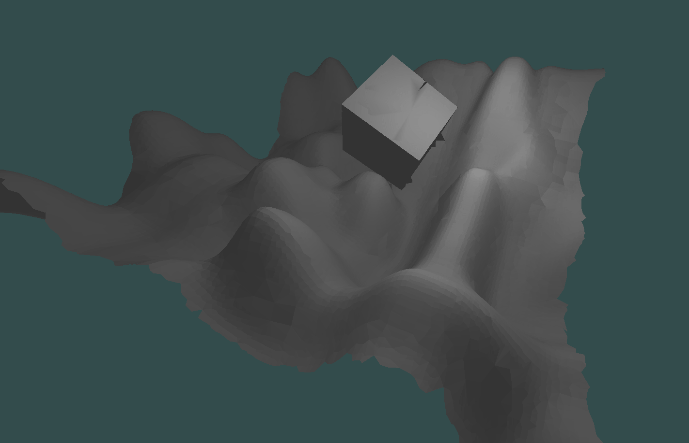
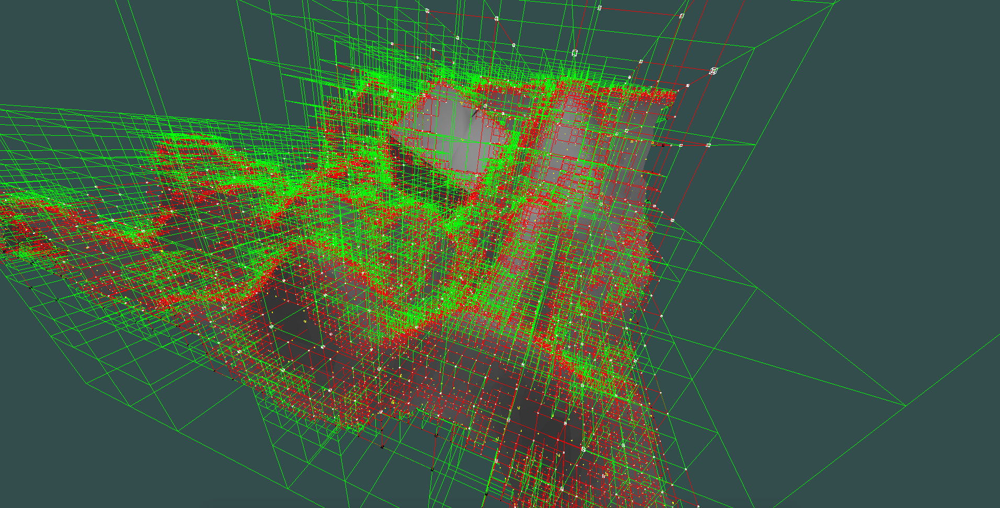
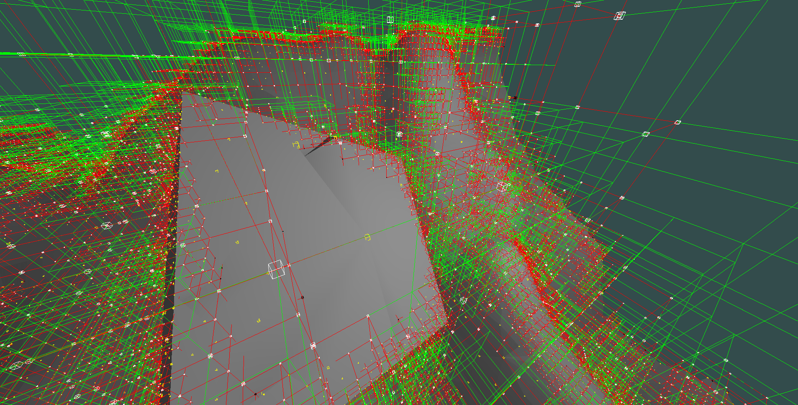
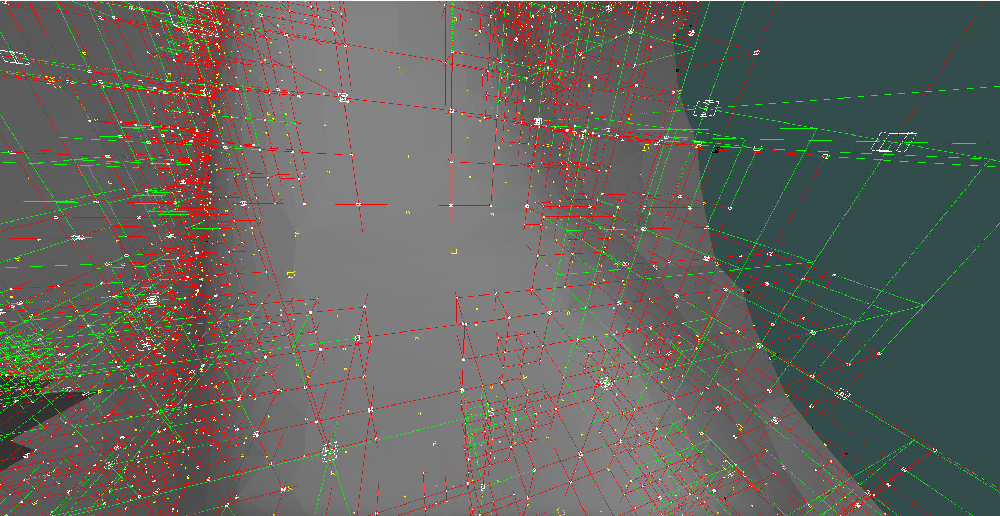

# voxelized3d
experimental 3D voxel engine

***REQUIRES NVIDIA VIDEO CARD(will be optional)***

________________________________________________________________________
#### INSTALLATION (LINUX + NVIDIA video card)

1)minimum OpenGL version 3.3 is required + libGL.so should be available in your PATH

2)install GLFW3

&nbsp;&nbsp;&nbsp;&nbsp;&nbsp;&nbsp;on ubuntu/debian it should be as simple as:

&nbsp;&nbsp;&nbsp;&nbsp;&nbsp;&nbsp;`sudo apt-get install libglfw3-dev`

&nbsp;&nbsp;&nbsp;&nbsp;&nbsp;&nbsp;or compile glfw3 from sources

3)CUDA is required (probably will be optional later), PATH also must be properly set

4)lapacke:

&nbsp;&nbsp;&nbsp;&nbsp;&nbsp;&nbsp;on ubuntu/debian:

&nbsp;&nbsp;&nbsp;&nbsp;&nbsp;&nbsp;`sudo apt-get install liblapacke-dev`

&nbsp;&nbsp;&nbsp;&nbsp;&nbsp;&nbsp;or compile from sources

5)install cmake(probably with GUI for simplicity)

&nbsp;&nbsp;&nbsp;&nbsp;&nbsp;&nbsp;on ubuntu/debian:

&nbsp;&nbsp;&nbsp;&nbsp;&nbsp;&nbsp;`sudo apt-get install cmake-gui`

6)compile cmake project in `bindings` directory of this project. After that copy outputted `libvoxelizedBindings.a` to the root of the project

7)install LDC https://dlang.org/download.html, DUB tool should be in your path after installation

8)run `export LD_LIBRARY_PATH=. && dub run --build=release`

________________________________________________________________________

#### INSTALLATION (Windows + NVIDIA video card)
Not yet tested(won't compile out of the box, needs some changes)

Will add Windows as target platform later
________________________________________________________________________

#### Screenshots

adaptive dual contouring (non manifold yet, produces self-intersecting triangles yet)

adaptive DC with octree simplification, cube in the middle is overly simplified (topology is a bit broken + non manifoldness uncovers itself in extra incorrect triangles below the cube):

problem with overly simplified cube can be easy solved by

storing extra information in voxels: can it(voxel) be simplified or not

or better: a distance at which simplification is prefered

__________________

same scene but with debug info

green nodes of the octree are voxels that do not contain the surface
those are called `homogeneous` nodes

red nodes contain the surface and are called `heterogeneous`

both types of nodes mentioned are `leaves` of the tree

One more type is `interior` or `internal` node.

Those are not rendered, they can contain all 3 types of nodes
as their child nodes (exactly 8)

_________

little yellow boxes represent points in space that form the geometry,
only those are present in the output triangulated surface

exactly one point is generated in non manifold DC per `heterogeneous` voxel

_____

a bit more simplification showing

in uniform variant of DC all nodes would be of the same minimal size

that would require more processing power and memory but also the output would more topologically correct

________________

sampled on GPU(CUDA), extracted on CPU(uniform DC)
